<div align="center">

<h3><code>mukund@github ~ $ ./contributions.sh</code></h3>


<br><br>

<h3><code>mukund@github ~ $ whoami</code></h3>
<table>
  <tr>
    <td valign="top"></td>
    <td valign="top"></td>
  </tr>
</table>

<br>

---

<h3><code>mukund@github ~ $ cat experience.log</code></h3>

</div>

**Google Summer of Code 2026** — Software Developer Contributor *(May 2026 – Present)*
> Developing a standalone Django plugin for native team and shift management at FOSSASIA. Engineered seamless platform integration using Django Signals and custom Middleware. Designed a scalable, multi-tenant data architecture with PostgreSQL and Django ORM.

**SortUs** — Software Engineering Intern, AI/ML *(June 2025 – Aug 2025)*
> Built ML-driven Green Points engine using FastAPI and Random Forest. Automated e-waste pricing via multi-feature regression (R² ≈ 0.85+). Integrated AI microservice into Node.js/MongoDB stack with JWT-secured transactions.

<div align="center">

---

<h3><code>mukund@github ~ $ ls projects/</code></h3>

</div>

| Project | What it does | Stack |
|---------|-------------|-------|
| [**EKIA**](https://github.com/MukundC25/EKIA-2) | Agentic AI code debugging assistant — 5-node LangGraph pipeline with FAISS + Neo4j GraphRAG | Python, FastAPI, LangGraph, Llama3, Neo4j |
| [**Refine**](https://github.com/MukundC25/Refine) | AI resume optimizer raising ATS scores by 45% | FastAPI, TypeScript, Gemini 2.5, PostgreSQL |
| [**FinMate**](https://github.com/MukundC25/FinMate) | SMS-based UPI expense tracker (92%+ parse accuracy) | React Native, TypeScript, SQLite, Supabase |
| [**Apta**](https://github.com/MukundC25/lrs) | Smart lifestyle recommender — TF-IDF + cosine similarity | Next.js, FastAPI, scikit-learn |
| [**V-Track**](https://github.com/MukundC25/vtrack) | Vehicle tracking & security with ESP32 + Google Geolocation | React, Flask, Google Maps API, Docker |

<div align="center">

---

<h3><code>mukund@github ~ $ neofetch --competitive</code></h3>

</div>

```
╭───────────────────────────────────────────╮
│  Platform    │  Rating        │  Solved   │
├───────────────────────────────────────────┤
│  LeetCode    │  1668 (Top 15%)│  200+     │
│  CodeChef    │  1682 (3★)     │  500+     │
│  Codeforces  │  1202 (Pupil)  │  —        │
╰───────────────────────────────────────────╯
   700+ problems solved · Top 20 in START196 · Top 10 Diamond League
```

<div align="center">

---

<h3><code>mukund@github ~ $ echo $LINKS</code></h3>

<br>

[](https://www.linkedin.com/in/mukundchavan2)
[](mailto:officialmukundchavan@gmail.com)
[](https://www.findmukund.me/)
[](https://www.codechef.com/users/mukundc)
[](https://leetcode.com/u/mukund2503)
[](https://github.com/MukundC25)

</div>
